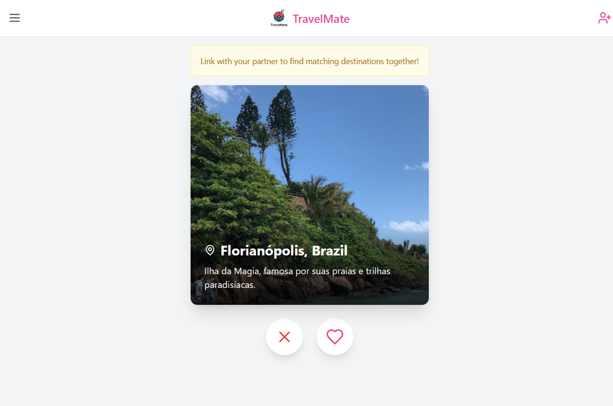

# 🌍 Travel-Mate

  

## ✈️ Sobre o Projeto
O **Travel-Mate** é um aplicativo de viagens inspirado no Tinder, onde casais podem dar "match" em destinos ao redor do mundo e compará-los entre si para decidir a melhor viagem juntos! 💑✨  

### 🔥 **Funcionalidades**
- 💖 **Swipe para direita** para curtir um destino.  
- ❌ **Swipe para esquerda** para rejeitar um destino.  
- 🔗 **Link com seu parceiro(a)** para comparar destinos que ambos curtiram.  
- 🏆 **Descubra os destinos mais compatíveis** e planeje sua viagem dos sonhos!  

---

## 🖼️ **Demonstração**

---

## 🛠 **Tecnologias Utilizadas**
- 🚀 **React + Vite** (Frontend)
- 🔥 **Firebase** (Autenticação e Banco de Dados)
- 💅 **CSS + Tailwind** (Estilização)
- 🖼️ **Unsplash API** (Imagens de destin
